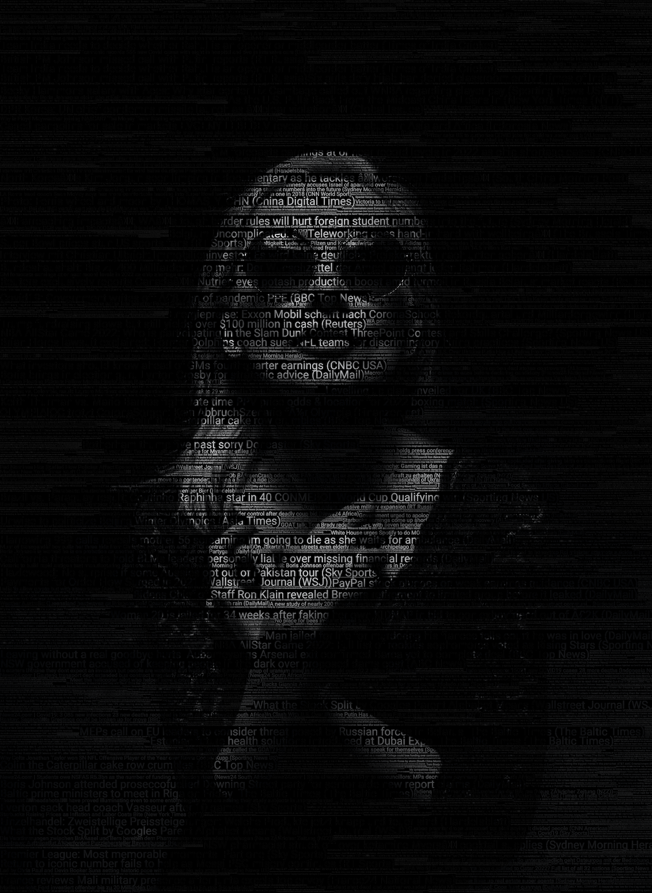

Put transparent text layer from input (csv) on top of image.

## config.ini example
```ini
[default]
; path to true type font (better) or system font name
font = Roboto-Regular.ttf
; comma separated list of font sizes and them weights (used in random choice, mean how often to take)
font_sizes = 8, 16
font_weights = 1, 1
; change combinations of font and background colors with opacity to get different results
; resulting image layers will be combined with alpha support
; font rgb color with opacity last value from 0 to 255, 0 - fully transparent
font_color = 255,255,255,0
bg_color = 0,0,0,255
; input can be *.txt or *.csv file path
text_file = news.csv
; better to provide input in "utf-8"
text_encoding = utf-8
; if input is csv file, detect how many columns for each row will be treated as separate input
csv_delimeter = ;
csv_columns = 2
; use this str separator between row content from csv file
separator = |
; open and close chars will be puted around content of second csv column
source_column_open_char = (
source_column_close_char = )
; append this suffix to resulting png file before extension
file_suffix = 
; comma separated list of input images paths, can be quoted with ' or "
image_files = input/lion.jpeg
out_dir = output
; mode "composite" (alpha blend) or "paste". (composite is better)
mode = composite
; guillotinebaflas - fast with same +- result as maxrectsblsf (which much slower)
algorithm = GuillotineBafLas
```

If args not provided, values from config will be used.

Examples:

Process 2 images to default 'output' folder:

`python3 app.py -i input/lion.jpeg -i input/car.jpeg`

Current version using `rectpack` for place text boxes over images

Some tests (1920x1080) M1 mac:

All `MaxRects` produce good results, but not fast, `GuillotineBafLas` very faster with same result

```
GuillotineBlsfMaxas: 0.01s
GuillotineBafMaxas: 0.01s
GuillotineBssfMaxas: 0.01s
GuillotineBssfLlas: 0.02s
GuillotineBafLas: 0.02s
GuillotineBafLlas: 0.02s
GuillotineBssfLas: 0.02s
GuillotineBlsfLlas: 0.03s
GuillotineBlsfLas: 0.03s
GuillotineBssfMinas: 0.03s
GuillotineBafMinas: 0.03s
GuillotineBlsfMinas: 0.03s
GuillotineBssfSas: 0.10s
GuillotineBafSas: 0.11s
GuillotineBssfSlas: 0.11s
GuillotineBlsfSas: 0.12s
GuillotineBlsfSlas: 0.14s
GuillotineBafSlas: 0.14s
MaxRectsBlsf: 0.47s
MaxRectsBaf: 0.48s
MaxRectsBl: 0.53s
MaxRectsBssf: 0.58s
```

