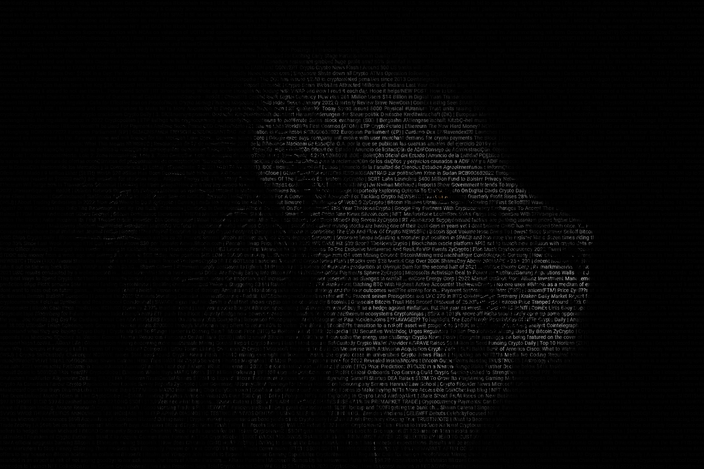

Put transparent text layer from input (txt or csv) on top of image.

## config.ini example
```ini
[default]
; path to true type font (better) or system font name
font = Roboto-Regular.ttf
font_size = 14
line_spacing = 1.0
; change combinations of font and background colors with opacity to get different results
; resulting image layers will be combined with alpha support
; font rgb color with opacity last value from 0 to 255, 0 - fully transparent
font_color = 20,20,20,20
bg_color = 0,0,0,255
; input can be *.txt or *.csv file path
text_file = news.csv
; better to provide input in "utf-8"
text_encoding = utf-8
; if input is csv file, detect how many columns for each row will be treated as separate input
csv_delimeter = ;
csv_columns = 2
; use this str separator between row content from csv file
separator = |
; open and close chars will be puted around content of second csv column
source_column_open_char = (
source_column_close_char = )
; append this suffix to resulting png file before extension
file_suffix = _with_text
; comma separated list of input images paths, can be quoted with ' or "
image_files = example.jpeg
```


Text is __'justified'__ over all image width and height. If text less then canvas size - it will be repeated by words (using cycle list)

Depends on font size and original image size - font measure can take a time:

Some results for python3.10 on MacBook M1 and font-size=14:

    fullhd image: ~3 sec
    5k image: ~ 25 sec


